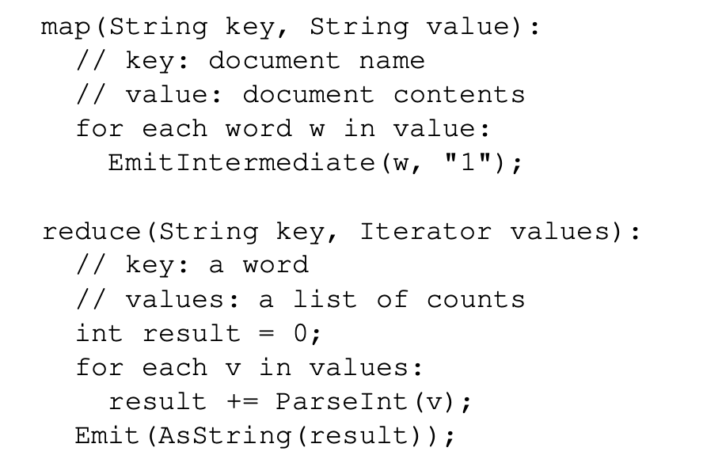
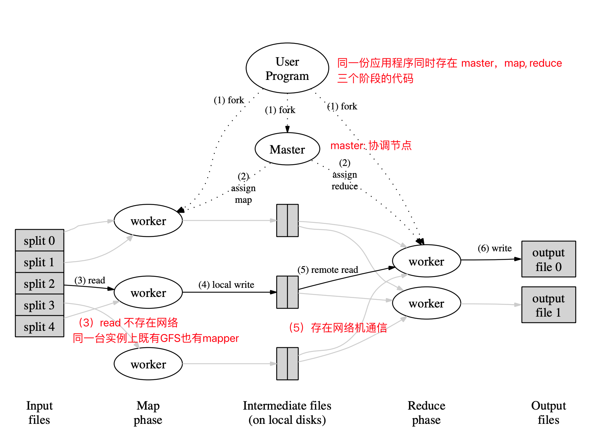

# Lecture1- Introduction
1. 分布式系统：mulitple networked cooperating computers 
需要插入个图片描述一下
*****

2. Why
2.1 连接物理上分离的机器。
共享数据，设备，算力.....
高容量
2.2  通过并行提高性能
高性能
2.3 容错能力
2.4 安全性
讲不同的东西分布在不同的物理机器上

******
历史背景
* 1980s DNS EMAIL (早期学习分布式系统的例子)
* 1990s DataCenter Big-Web-Sites
大量用户，大量数据（google facebok）
> 这段时期的工程师发布了大量的分布式系统论文
*  2000s cloud computing (云计算)

******
分布式系统挑战
1. 系统高并发高并行如何协作
2. 必须思考容错（分布式种将宕机作为正常状态，网络断联等）
例如：两者的混合让分布式系统的行为更加难以预测——脑裂 
3.  如何保证机器数增长和性能的提升有正相关
可能到某个界限后，错误设计的系统性能不再能因为机器数量的增加增加，甚至可能会降低。
例如：ES的master节点。（热点问题）

******
为什么学习6.824
1. 有趣： hard problems but powerful solutions
2. 它是一个实际逻辑并广泛应用领域
3. 具有研究领域（研究生）
4. 可以学习到分布式编程技巧

需要课前准备
1. 阅读paper
2. 准备完成lab
* mapreduce (分布式基础)：分布式并行任务计算
* raft (分布式协议)：分布式系统交互 （当分布式机器异常时怎么快速转移，拉起，复制实例）
* replicated KV service (复制的kv服务) ：学习_冗余复制_。 （冗余不会提升性能）
* sharded KV service (分片服务)： 分布式性能提升方案
* optional 自己设计一个分布系统的业务系统
3. 通过用例case。争取满分（相当有挑战性，调试也很难）

234这三个lab是存在递进关系，所以需要每一步就开始。

6.828
6.S081

> 通过同一个机器模型多进程进行测试
对自己的要求，lab一定要贴合理论。工程实践可以做一些取舍。
*******
## 分布式的基础设施（infrastructure）
 1. Storage （存储）
	Redis, Mysql
 3. Computation （计算）
    MapReduce
 4. Communication (通信) 6.829
	 RPC
## 主题 核心内容（main-topics)
CAP
1. 容错 （Fault tolerance）: 高可用且具备可恢复能力
两个特点：
* 可用性 (Availability): 
	通过复制（replication）技术解决，保证单机故障后任务仍然可以继续执行。
* 可恢复性（recoverability):
	通过日志logginn, 事务transaction， 写入存储中。重启后服务可以恢复到原来的状态并继续提供服务

2. 一致性（Consistency）

3. 高性能（Performance）
* 高吞吐 （high throughput）
* 低延时 （low latency）
	尾端延时：某些低性能服务影响整个服务链路的实验
实践工程中一般是CP,AP

>  Lab中要注意以上主题的实现（implementation）
	* Lab中需要学习如何管理并发性
	* 学习RPC的调用逻辑
******
## Paper阅读（mapreduce） 6.033
系统背景： mulit-hours and TB data
目标: 让非专业人士简单地编写分布式应用。
解决方法：1. mapreduce（函数式顺序框架）2. MR deal with distribution （合并分布式的请求和结果）
> map-reduce是一种非通用的代码框架，他会要求所以想使用这个框架系统按照这个逻辑进行编排。

例如抽象图： 从f1,f2,f3统计单词频率
f1 ---map---> (a,1)		(b,1)  				 
f2 ---map---> 			(b,1)                
f3 ---map---> (a,3)					(c,1)    
                            |           |          |
						reduce.   |		   |
							|		reduce.   |
							|			|       reduce
							|           |          |
						(a,4)	     (b,2)     (c,1)
						
map的过程服务器之前不需要通信，reduce时需要进行通信。

mapreduce中最昂贵的部分是中间数据。（_感觉没有讲明白，昂贵的是因为存储还是通信或事其他的_）

框架

论文中文件的存储是位于GFS(google的分布式文件存储系统)。 
(6)write通过网络写入GFS

****

# Fault tolerance (容错)
if worker fail, then master restart task.
1. 重启成功
2. 重启失败
问题：同一个map逻辑为了容错可以重复执行？
一种是map-worker异常没有执行成功，另一种是map-worker因为网络问题没有返回，但是其实已经执行完成了，这种场景是mapreduce是会常见的。
因此需要保证map/reduce是函数式编程接口，无状态，稳定，相同的输入无论调用几次，无论什么时候调用结果都要是一样的。
 
 Other failures
 1. 协调器（master）会失败吗？会失败但是不能允许。
在当前的架构(map reduce)中,如果协调器异常，通常 需要重新执行整个mapreduce任务。
所以解决方案就是master节点的物理主机安全性最高。
 
 2.  Slow Worker(straggler) 落后节点？
 让同一个任务由多个worker进行，取最快的worker即可。
 
> 思考mapreduce的异常case. work fail, slow worker,  master broken等等，每一个case都需要关注。